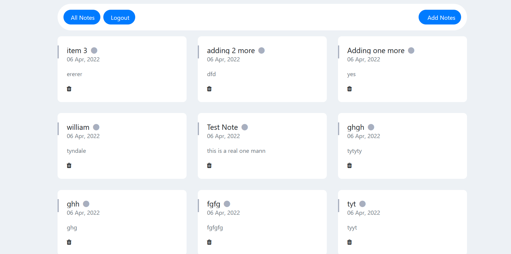

# inisev-test-notice-board
Creating a Notice board kinda system with PHP and MySQL
It's really basic though. Auto updates for new notes added/deleted every 20 seconds.

Sections
 - Admin Section
    - Add Note
    - Delete Note
 
 - User secion
     - View Notes
 
 ### GLance
 
 
 ### How to install and Use
  - Run the DB install to your taste in the `database` folder.
  - Incase you need to, you could run `composer dump-autoload -o` (optional)
  - `include/_config.php` is the config file, edit your db_data ish there.
  - Admin login details 🤡
     - Email: admin@admin.com
     - Password: password 
     - 
   
   #### That's All!
   It's very basic, enjoy your day folks.
